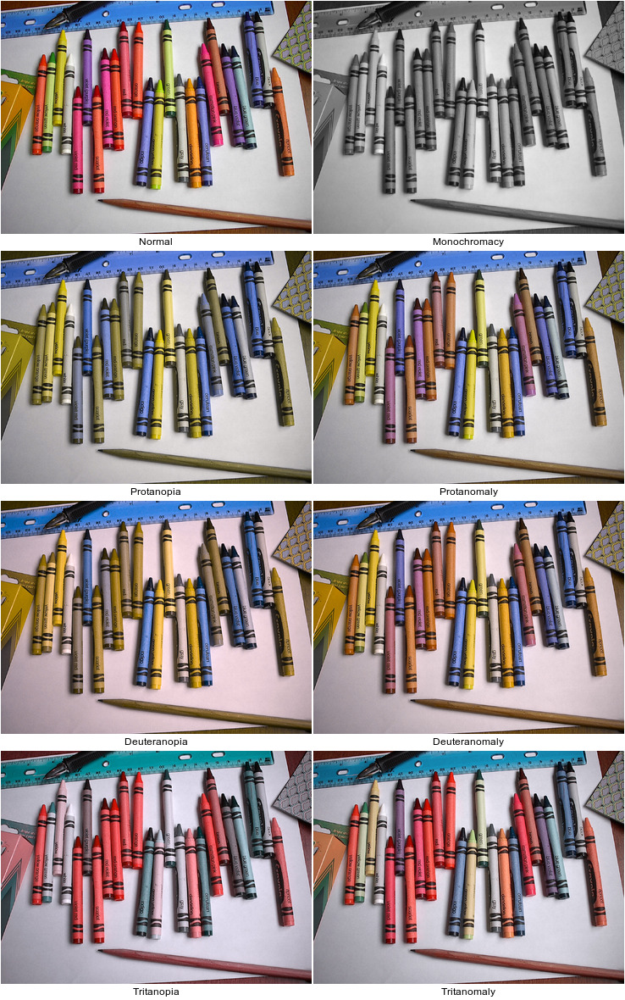

# Peacock, what is it?

Peacock is an application to convert static images (PNG, JPEG, etc.) from a
full-color representation to something attempting to simulate what a colorblind
person might see.

**The objective of Peacock is to increase the accessibility of digital graphics
and was originally created to verify that scientific visualizations were not
ambiguous and/or misleading to colorblind viewers.**

[Coblis—Color Blindness
Simulator](http://www.color-blindness.com/coblis-color-blindness-simulator/) and
other such similar utilities are available online; however, sometimes online
resources are inconvenient or inaccessible.  Adobe Photoshop and other offline
resources provide colorblindness simulation; however, all offline tools that
could be located were cumbersome when processing multiple images for multiple
forms of colorblindness.  So, Peacock was written to provide an offline
mechanism to simulate color blindness capable of being used with batch
processing.

The types of colorblindness that can be simulated are (with prevalence
information from [here](http://www.webexhibits.org/causesofcolor/2C.html) as
cited on
[Wikipedia](https://en.wikipedia.org/wiki/Color_blindness#Epidemiology)):

|                                                | **Males Affected (%)** | **Females Affected (%)** |
|:----------------------------------------------:|:----------------------:|:------------------------:|
|               **Dichromacy**                   |           2.4          |           0.03           |
|    Protanopia (red deficient: L cone absent)   |           1.3          |           0.02           |
|  Deuteranopia (green deficient: M cone absent) |           1.2          |           0.01           |
|   Tritanopia (blue deficient: S cone absent)   |          0.001         |           0.03           |
|          **Anomalous trichromacy**             |           6.3          |           0.37           |
|   Protanomaly (red deficient: L cone defect)   |           1.3          |           0.02           |
| Deuteranomaly (green deficient: M cone defect) |            5           |           0.35           |
|   Tritanomaly (blue deficient: S cone defect)  |         0.0001         |           0.001          |
|                 **Other**                      |                        |                          |
|     Monochromacy (total color blindness)       |          rare          |           rare           |

# Why are there Python and C++ verions?

The Python version (Peacock as `peacock.py`) came first as a proof of concept.
It was built using the conversion coefficients and process from
[Coblis](http://www.color-blindness.com/coblis-color-blindness-simulator/) (with
permission; see [License Information](#LicenseInformation) for more
information).

More details on the Python version are available in its [README
file](python/README.md).

However, the Python version is relatively slow.  So, the C++ version was created
(Peacock++ as `peacock`).  More details on the C++ version are available in its
[README file](cpp/README.md).  The Python version is kept because (a) some users
might find it more accessible and (b) the C++ version depends on ImageMagick
(Magick++), which some users may not have easy access to.

Converting the ["Normal"
image](https://commons.wikimedia.org/wiki/File:Crayola_24pack_2005.jpg)
(original resolution 1600x1200) below to simulate the seven available forms of
colorblindness takes approximately 4.5 minutes with Python and approximately 5
seconds with C++ (the C++ is roughly a factor of 50 faster than Python).

The shell script used to create the montage above is available
[here](readme_files/montage.sh).

# License Information

The conversion processes and coefficients herein are used with permission from
[Colblindor](http://www.color-blindness.com/) and were therein used with
permission of Matthew Wickline and the [Human-Computer Interaction Resource
Network](http://www.hcirn.com/) for non-commercial purposes.  As such, this code
may only be used for non-commercial purposes.

[Original (Normal)
image](https://commons.wikimedia.org/wiki/File:Crayola_24pack_2005.jpg) above
obtained at the linked URL and is used under the under the Creative Commons
Attribution-Share Alike 3.0 Unported license.

Peacock++ uses the `args.hxx` header-only C++ command line option parser for
command line argument processing from [here](https://github.com/Taywee/args).
This file is used under the MIT license (see top of `args.hpp`).   More
information in [Peacock++'s README](cpp/README.md#OSSCredits).
